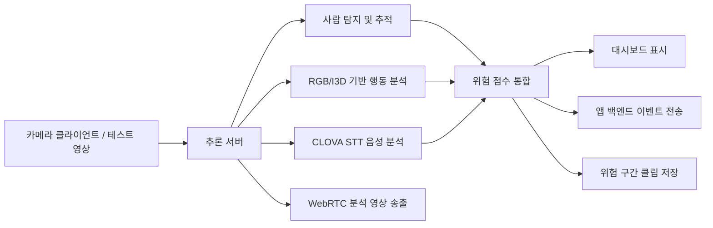
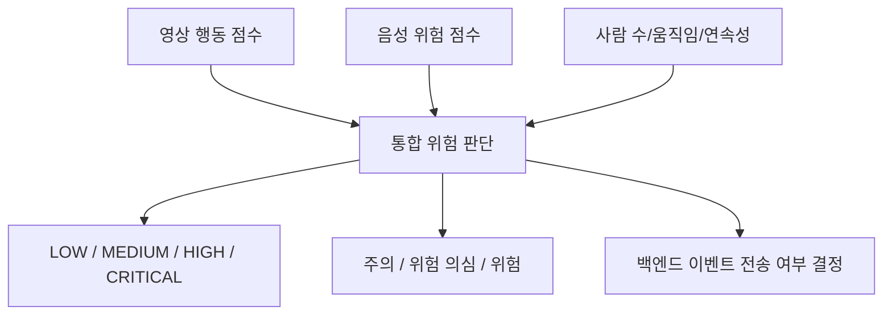

# detectWarning 추론 서버 발표 설명 문서

이 문서는 발표에서 detectWarning의 추론 서버가 어떤 흐름으로 위험 상황을 감지하는지 설명하기 위한 자료입니다. 핵심은 **영상 기반 위험행동 분석**, **CLOVA Speech Recognition 기반 음성 위험 신호 분석**, **영상+음성 통합 위험 점수**, **PWA/백엔드 연동**입니다.

## 1. 전체 구조 요약

detectWarning은 학습이 끝난 모델을 실제 CCTV/웹캠/테스트 영상에 적용하기 위한 실시간 추론 서버를 중심으로 동작합니다.

주요 구현 파일은 다음과 같습니다.

- `app/inference_server.py`: 추론 서버 API, 대시보드, 백엔드 연동, 영상 테스트, WebRTC 송출
- `app/action_realtime.py`: 실시간 행동 인식 모델 로딩 및 추론
- `app/risk_analyzer.py`: 영상/음성 위험 점수 계산 및 통합 판단
- `app/person_classifier.py`: 사람 후보 검증, 오탐 완화, 시각화
- `app/detector.py`: YOLO 기반 사람/포즈 탐지
- `app/webrtc_stream.py`: 분석 프레임을 WebRTC video track으로 송출
- `app/camera_uploader.py`: 맥북/윈도우 카메라 프레임을 추론 서버로 전송

## 2. 입력 방식

추론 서버는 세 가지 방식으로 입력을 받을 수 있습니다.

1. **원격 카메라 업로더**
   - 맥북이나 다른 노트북에서 `camera_uploader.py`를 실행합니다.
   - 카메라 프레임을 `/analyze/frame`으로 전송합니다.
   - 음성 사용 시 오디오 조각을 `/analyze/audio`로 전송합니다.

2. **데스크탑 서버 직접 웹캠**
   - 추론 서버가 실행되는 컴퓨터에서 직접 카메라를 사용할 수 있습니다.
   - 발표나 로컬 테스트에 적합합니다.

3. **영상 테스트 전용 클라이언트**
   - 대시보드에서 영상 파일을 업로드해 테스트합니다.
   - 영상이 HEVC/H.265처럼 브라우저에서 재생이 어려운 형식이면 H.264 MP4로 변환합니다.
   - 휴대폰 세로 영상은 긴 변 기준으로 리사이즈해서 FPS 저하를 줄입니다.

## 3. CCTV 고유 코드와 클라이언트 관리

각 카메라/클라이언트는 고유한 CCTV 코드로 관리됩니다.

- 같은 클라이언트는 같은 코드가 유지됩니다.
- 앱 사용자는 PWA에서 이 코드를 입력해 CCTV를 연결합니다.
- 추론 서버는 백엔드에 CCTV 정보를 동기화합니다.
- 카메라가 없거나 프레임이 없으면 `has_frame=false`, `cameraOnline=false` 같은 상태를 내려줍니다.

백엔드 동기화 payload에는 다음 정보가 포함됩니다.

- CCTV 코드, 이름, 위치, 상태
- 최신 위험 점수
- 분석 프레임 URL / WebRTC offer URL
- 카메라 온라인 여부
- 분석 FPS, 원본 FPS
- 분석 프레임 크기와 비율

## 4. 영상 분석 로직

영상 분석은 단일 프레임만 보는 방식이 아니라, 최근 프레임 흐름을 보고 판단합니다.

### 4.1 사람 탐지 및 추적

YOLO 기반 사람 탐지를 사용해 프레임 안의 사람 후보를 찾습니다. 이후 `PersonPresenceFilter`가 후보를 검증합니다.

검증 기준은 다음과 같습니다.

- 사람 박스 confidence
- 상반신/전신 여부
- 박스 크기와 위치
- 포즈/관절점 품질
- 이전 프레임과의 연속성
- 사람이 아닌 사물 오인 가능성

이 단계의 목적은 **사물을 사람으로 오인하는 경우**와 **순간적인 잘못된 탐지**를 줄이는 것입니다.

### 4.2 RGB/I3D 기반 행동 인식

`RealtimeActionRecognizer`는 최근 프레임을 버퍼에 모아 행동 인식을 수행합니다.

현재 주요 클래스는 다음입니다.

- `violence`: 폭행/몸싸움
- `collapse`: 쓰러짐
- `loitering`: 배회
- `normal`: 정상 또는 위험 아님

행동 분석은 다음 신호를 함께 봅니다.

- RGB/I3D feature 기반 이상행동 점수
- 클래스 분류 confidence
- 최근 후보 라벨의 연속성
- 사람 이동량과 중심점 변화
- 클래스별 보정 규칙

클래스별 후처리도 적용됩니다.

- violence는 순간적인 자세 변화만으로 바로 확정하지 않고 confidence와 abnormal score를 함께 봅니다.
- collapse는 정지 상태, 낮은 자세, 움직임 감소 같은 조건을 함께 봅니다.
- loitering은 단순히 서 있는 사람을 배회로 오탐하지 않도록 이동량과 정지 상태를 같이 봅니다.

### 4.3 보조 파인튜닝 모델

폭행/쓰러짐처럼 오탐이 중요한 클래스는 보조 모델을 조건부로 사용할 수 있게 되어 있습니다.

- fight BiLSTM: violence 확인 신호
- fall BiLSTM: collapse 확인 신호

이 모델들은 주 모델을 완전히 대체하지 않고, 특정 클래스가 의심될 때 보조 점수로 사용됩니다. 이렇게 한 이유는 일반 상황에서 불필요한 추론을 줄이고, 오탐 가능성이 높은 순간에만 확인 신호를 더하기 위해서입니다.

## 5. 음성 위험 감지 로직

음성 분석은 CLOVA Speech Recognition 기반으로 동작합니다.

### 5.1 STT 처리

오디오가 들어오면 바로 CLOVA에 보내지 않고, 먼저 간단한 품질 검사를 합니다.

- 오디오 길이가 너무 짧은지 확인
- 음량이 너무 작은지 확인
- 피크가 너무 낮은지 확인
- 실제 발화 활동 구간이 있는지 확인

이 검사를 통과한 오디오만 CLOVA STT로 보냅니다. 이 구조는 비용과 지연을 줄이고, 무음이나 잡음으로 인한 불필요한 API 호출을 막기 위한 것입니다.

### 5.2 키워드와 문맥 점수

STT 결과 텍스트는 `RiskAnalyzer`에서 위험 표현과 비교됩니다. 단순히 키워드 하나만 발견했다고 바로 위험으로 확정하지 않고, 다음 요소를 같이 봅니다.

- 구조 요청 표현: “도와주세요”, “살려주세요”, “신고해주세요”
- 위협 표현: “가만 안 둬”, “죽여버린다” 등
- 폭행/저지 표현: “때리지 마”, “그만해”, “하지 마”
- 비명/큰 소리 계열 신호
- 반복성
- 최근 영상 위험 신호와의 관계

STT 원문과 matched keywords는 백엔드로 보내지 않습니다. 개인정보 보호를 위해 백엔드에는 `audioRiskSignalDetected`, `audioScore`, `audioVideoGain` 같은 메타데이터만 전달합니다.

## 6. 영상+음성 통합 판단

detectWarning의 강점은 영상과 음성을 단순 OR로 합치는 것이 아니라, 각각의 신호를 점수화한 뒤 통합한다는 점입니다.

통합 판단에서는 다음 값을 만듭니다.

- `videoScore`: 영상만 봤을 때의 위험 점수
- `audioScore`: 음성만 봤을 때의 위험 점수
- `riskScore`: 최종 통합 위험 점수
- `audioVideoGain`: 음성이 들어와서 최종 위험 점수가 얼마나 상승했는지
- `riskSignalSource`: `video`, `audio`, `audio_video` 중 어떤 신호가 주도했는지

발표에서 강조할 수 있는 포인트는 다음입니다.

> 영상만으로는 애매한 상황에서도, “도와주세요”, “때리지 마세요” 같은 음성 신호가 함께 들어오면 최종 위험 점수를 높여 더 빠르게 위험 상황으로 판단합니다. 반대로 음성만으로는 바로 100점으로 보내지 않고, 반복성/위험도/영상 신호를 함께 봐 오탐을 줄입니다.

## 7. 이벤트 전송과 상태 머신

위험 이벤트는 점수가 한 번 튀었다고 바로 백엔드로 보내지 않습니다. 클래스별 threshold와 상태 머신을 사용합니다.

예시 정책:

- violence: 비교적 높은 confidence가 필요하므로 warning/danger 기준을 높게 둠
- collapse: 실제 위험성이 크므로 상대적으로 빠르게 감지
- loitering: 오탐이 쉬워 더 긴 지속성과 높은 기준 필요
- audio risk: 음성만으로는 반복 확인 후 전송

이벤트 전송 전에는 다음을 확인합니다.

- 클래스별 warning threshold 이상인지
- danger threshold면 즉시 전송 가능한지
- warning이면 필요한 반복 hit 수를 채웠는지
- 같은 사건을 너무 자주 보내지 않도록 cooldown을 지키는지
- 최근 이벤트와 동일한 signature인지

이 구조 덕분에 순간적인 오탐, 짧은 노이즈, 일시적인 STT 오류가 바로 푸시 알림으로 이어지는 것을 줄입니다.

## 8. 위험 구간 클립 저장

위험 이벤트가 발생하면 분석 프레임 기준으로 클립을 저장할 수 있습니다.

- 최근 20~30초 분석 프레임을 링버퍼로 유지
- 위험 판단 시점 기준 전 5초 + 후 10초, 총 15초 MP4 생성
- 클립은 관절점/박스/점수 오버레이가 들어간 분석 프레임 기준
- iPhone Safari/PWA 재생을 위해 Range 요청 지원
- 백엔드 이벤트 payload에 `clipUrl` 포함

이 기능은 발표에서 “왜 위험으로 판단했는지 사후 확인 가능하다”는 근거로 보여주기 좋습니다.

## 9. WebRTC 영상 송출

백엔드/PWA는 추론 서버의 분석 영상을 WebRTC로 볼 수 있습니다.

기존 JPEG polling 방식은 다음 문제가 있었습니다.

- 프레임 요청이 잦아 서버 부담 증가
- 네트워크 상황에 따라 뚝뚝 끊김
- 대시보드와 PWA FPS가 다르게 보임

현재 구조는 `/api/client/{client_id}/webrtc/offer`로 offer를 보내면 추론 서버가 answer를 반환하고, 최신 분석 프레임을 video track으로 송출합니다.

또한 최근 수정으로 실제 분석 프레임 비율을 백엔드에 전달합니다.

- 세로 영상은 세로 비율로 표시
- 가로 영상은 가로 비율로 표시
- 휴대폰 영상의 양옆 공백과 잘림을 줄임
- 긴 변 기준 리사이즈로 FPS 저하 완화

## 10. 대시보드에서 볼 수 있는 정보

추론 서버 대시보드는 운영자가 현재 상태를 빠르게 볼 수 있도록 구성되어 있습니다.

주요 표시 항목:

- 실시간 분석 프레임
- 위험 점수
- 영상 점수 / 음성 점수 / 통합 상승 점수
- 감지 클래스
- 사람 수
- 분석 FPS
- STT 상태
- GPU/RAM 상태
- 이벤트 기록
- CCTV 이름/위치/연결 코드
- 영상 테스트 클라이언트

발표 모드에서는 추론 서버 화면과 백엔드 PWA 화면을 나란히 보여주기 좋도록 화면 요소를 정리했습니다.

## 11. 개인정보 보호 설계

음성 인식이 들어가는 프로젝트이므로 개인정보 처리가 중요합니다.

detectWarning은 다음 원칙을 적용합니다.

- STT 원문을 앱 백엔드로 보내지 않음
- matched keywords를 백엔드로 보내지 않음
- 백엔드에는 위험 신호 여부와 점수만 전송
- 위험 이벤트에는 `audioRiskSignalDetected`, `audioScore`, `audioVideoGain` 같은 메타데이터만 포함
- 클립 저장은 분석 프레임 중심이며 STT 원문은 저장하지 않음

발표에서는 “음성 인식을 사용하지만 원문을 서버 간 공유하지 않고 위험 판단 메타데이터만 전달한다”고 설명하면 좋습니다.

## 12. 발표에서 강조할 강점

### 강점 1. 영상 단독보다 음성을 결합했을 때 위험 감지력이 좋아짐

영상만으로는 폭행/배회/쓰러짐이 애매한 경우가 있습니다. 예를 들어 사람이 앉거나 몸을 숙이는 장면은 collapse로 오탐될 수 있고, 기다리는 사람은 loitering처럼 보일 수 있습니다.

이때 음성에서 “도와주세요”, “그만해”, “때리지 마” 같은 신호가 같이 들어오면 위험 점수를 높이고, 반대로 음성이 없거나 약하면 더 신중하게 판단합니다.

### 강점 2. 단순 키워드 감지가 아니라 통합 위험 점수

음성 키워드 하나로 바로 위험을 확정하지 않습니다. 영상 점수, 음성 점수, 반복성, 지속 시간, 클래스별 threshold를 함께 봅니다.

### 강점 3. 실제 운영을 고려한 구조

- 여러 카메라/클라이언트 연결 가능
- 카메라별 고유 코드
- PWA와 백엔드 연동
- WebRTC 영상 송출
- 위험 클립 저장
- 서버/카메라 끊김 상태 관리
- 중복 이벤트 전송 방지

### 강점 4. 발표 시연에 적합한 설명 가능성

각 위험 이벤트에는 판단 이유, 점수, 음성 보강 여부, 영상 근거, 클립 URL이 남습니다. 따라서 “왜 위험으로 판단했는가”를 대시보드와 PWA에서 설명할 수 있습니다.

## 13. 발표용 짧은 설명 예시

> 저희 프로젝트는 CCTV 영상만 보는 것이 아니라, 영상과 음성을 함께 사용해 위험 상황을 감지합니다. 영상에서는 사람 탐지, 추적, RGB 기반 행동 인식을 통해 폭행, 쓰러짐, 배회 같은 행동을 판단하고, 음성에서는 CLOVA Speech Recognition을 사용해 구조 요청이나 위협 표현을 감지합니다. 두 결과를 단순히 OR로 합치지 않고, 영상 점수와 음성 점수를 각각 계산한 뒤 최종 위험 점수로 통합합니다. 그래서 영상만으로 애매한 상황에서도 음성이 함께 들어오면 더 빠르게 위험으로 판단할 수 있고, 반대로 음성만으로 과도하게 오탐하지 않도록 반복성, 지속 시간, 클래스별 threshold를 적용했습니다.

## 14. 질의응답 대비 포인트

### Q. 왜 음성을 사용했나요?

영상만으로는 사람이 싸우는지 장난치는지, 쓰러진 건지 앉은 건지 애매한 경우가 있습니다. 음성의 구조 요청이나 위협 표현이 함께 들어오면 위험 판단의 확신도를 높일 수 있습니다.

### Q. STT 원문은 저장되나요?

아니요. 추론 서버 내부 판단에는 사용하지만, 앱 백엔드에는 STT 원문이나 matched keywords를 보내지 않습니다. 위험 신호 여부와 점수 같은 메타데이터만 보냅니다.

### Q. 오탐은 어떻게 줄였나요?

클래스별 threshold, 연속 프레임 확인, cooldown, 상태 머신, loitering 정지 상태 완화, 음성 반복 확인을 적용했습니다.

### Q. 영상이 끊기지 않게 한 방법은 무엇인가요?

JPEG polling 대신 WebRTC 송출을 사용하고, 분석 프레임의 실제 비율과 FPS를 백엔드/PWA에 전달합니다. 또한 휴대폰 세로 영상은 긴 변 기준으로 리사이즈해 처리 부담을 줄였습니다.

### Q. 위험 이벤트가 발생하면 무엇이 남나요?

위험 점수, 위험 클래스, 판단 이유, 영상/음성 점수, 음성 보강 여부, 이벤트 시간, 필요 시 위험 구간 클립 URL이 남습니다.

## 15. 시연 추천 흐름

1. 추론 서버 대시보드 실행
2. 영상 테스트 전용 클라이언트에 샘플 영상 업로드
3. 대시보드에서 분석 프레임, 사람 탐지, 위험 점수 변화 확인
4. 백엔드 PWA에서 같은 CCTV 코드로 연결된 화면 확인
5. 위험 이벤트 발생 시 PWA 기록 목록과 상세 화면 확인
6. 음성이 포함된 영상에서 `영상만 점수`와 `음성 결합 후 점수` 차이 강조
7. 위험 클립이 있으면 해당 클립으로 판단 근거 설명

## 16. 한 줄 결론

detectWarning 추론 서버는 **영상 행동 인식 + CLOVA 음성 위험 신호 + 클래스별 안정화 로직 + WebRTC/PWA 연동**을 결합해, 단순 영상 감지보다 실제 위험 상황을 더 설명 가능하고 안정적으로 감지하도록 설계된 시스템입니다.
