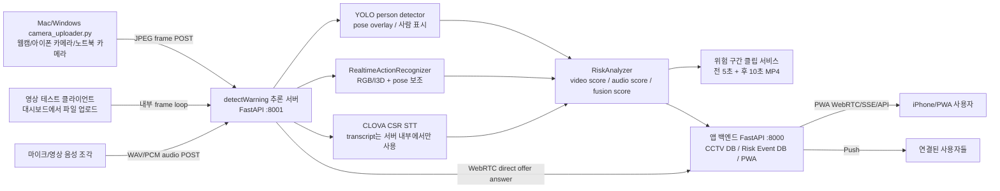
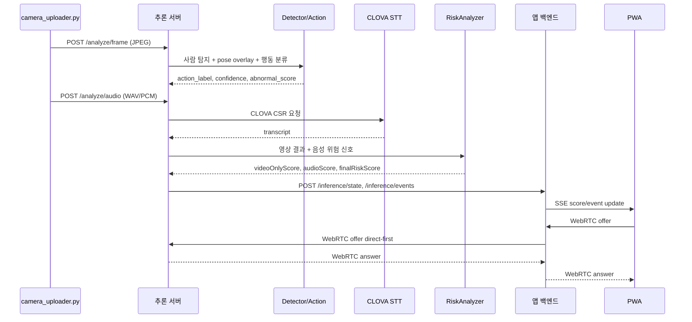
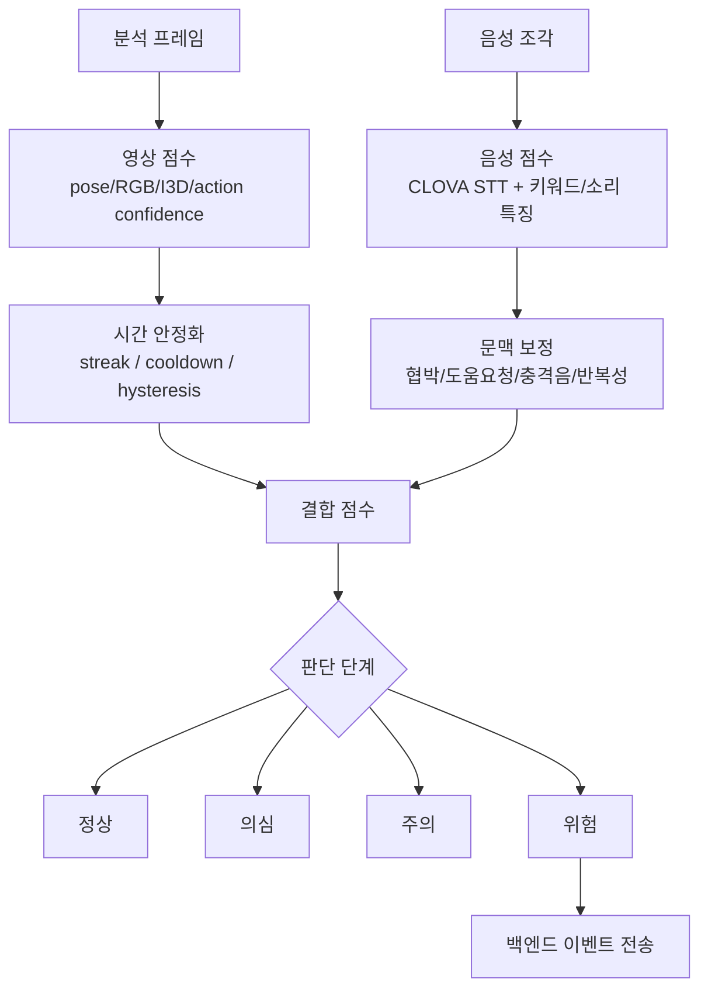
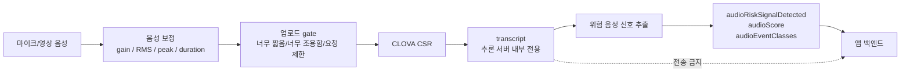
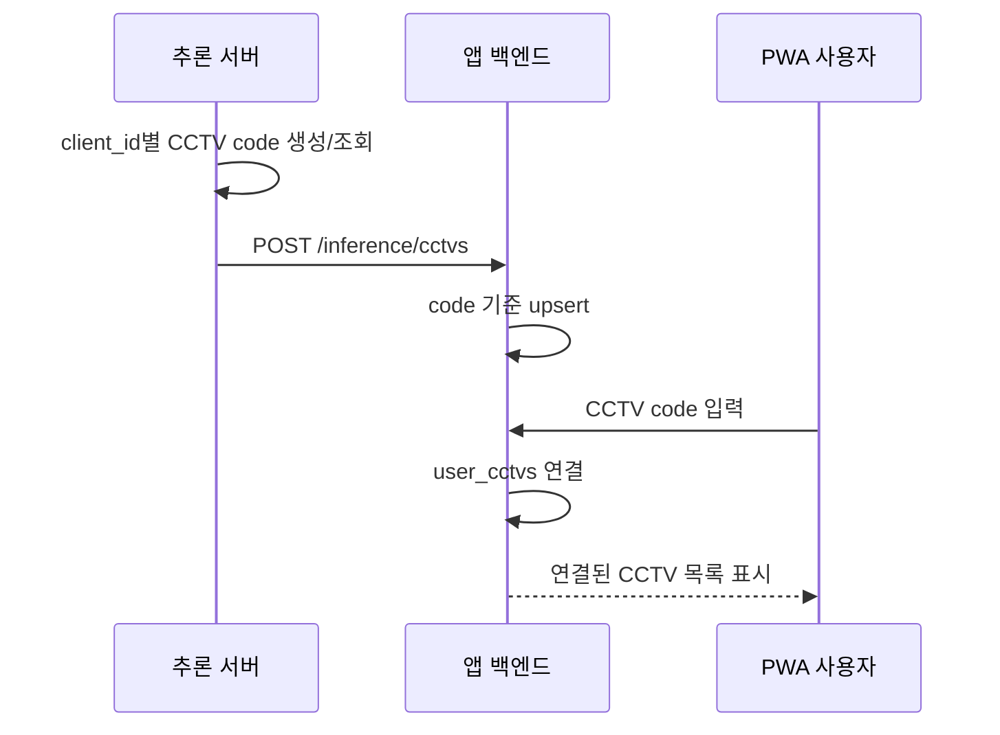
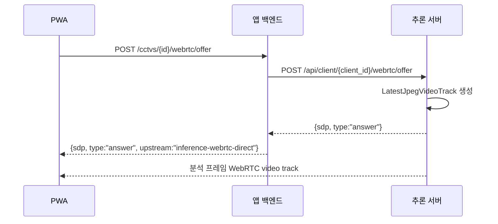
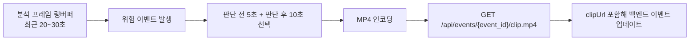
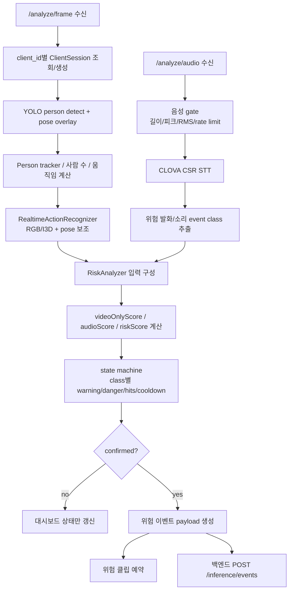
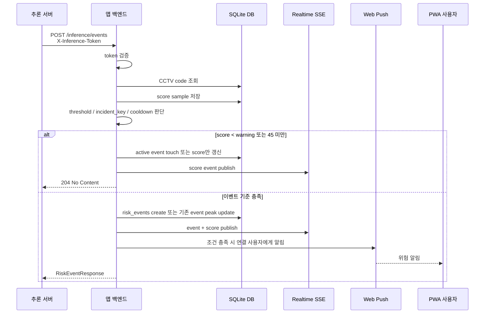

# detectWarning 추론 서버 / 앱 백엔드 구현 문서

작성일: 2026-06-02  
범위: 추론 서버, 카메라 업로더, 영상 테스트 클라이언트, CLOVA STT, 위험 판단, WebRTC 송출, 앱 백엔드/PWA 연동

## 1. 한 장 요약

detectWarning은 CCTV/웹캠/테스트 영상에서 사람, 자세, 행동, 음성 위험 신호를 함께 분석해 위험 상황을 판단하는 실시간 감지 시스템이다. 추론 서버는 영상 프레임과 음성 조각을 받아 분석하고, 앱 백엔드는 CCTV 코드 기반 연결, 위험 기록, PWA 화면, 푸시 알림, WebRTC 중계를 담당한다.

핵심 강점은 영상만 사용한 위험 점수와 영상+음성을 결합한 위험 점수를 동시에 계산한다는 점이다. 대시보드의 발표 모드에서 `영상만`, `영상+음성`, `Audio gain`을 나란히 보여주기 때문에 “음성 인식이 위험 감지 성능을 얼마나 끌어올렸는지” 설명할 수 있다.

현재 추론 클래스는 실사용 기준으로 `violence`, `collapse`, `loitering` 중심이다. `normal`은 정상/오탐 억제를 위한 기준 상태로 쓰이고, 학습에서 제외된 `abduction`은 추론 로직의 주요 위험 클래스로 쓰지 않는다.

## 2. 전체 아키텍처



## 3. 주요 구성 파일

| 영역 | 파일 | 역할 |
| --- | --- | --- |
| 추론 서버 본체 | `app/inference_server.py` | FastAPI 대시보드, 클라이언트 세션, 분석 API, WebRTC offer, 백엔드 이벤트 전송 |
| 카메라 업로더 | `app/camera_uploader.py` | Mac/Windows 카메라 프레임과 음성 조각을 추론 서버로 전송 |
| 행동 인식 | `app/action_realtime.py` | 실시간 행동 분류, RGB/I3D, pose 보조 점수, 클래스별 안정화 |
| 위험 판단 | `app/risk_analyzer.py` | 영상 점수, 음성 점수, 결합 점수, 위험 카테고리, 오탐 완화 |
| 음성 인식 | `app/stt_service.py` | CLOVA CSR 호출, 음성 정규화, 요청 제한, 빈 응답 처리 |
| WebRTC 송출 | `app/webrtc_stream.py` | 최신 분석 프레임을 WebRTC video track으로 송출 |
| 위험 클립 | `app/event_clip_service.py` | 분석 프레임 링버퍼, MP4 클립 생성, Range 요청 지원 |
| 백엔드 통신 안정화 | `app/backend_bridge.py` | circuit breaker, 백엔드 장애 시 과도한 전송 차단 |
| 런타임 상태 | `app/runtime_state.py` | 클라이언트 상태 스냅샷 유틸 |
| 시스템 모니터링 | `app/system_monitoring.py` | CPU/RAM/GPU/CLOVA 사용량 health 표시 |
| 앱 백엔드 | `C:/Users/Administrator/Documents/Codex/2026-05-19/ios/app_backend/app/main.py` | CCTV 등록, 이벤트 수신, WebRTC direct-first, PWA API |
| 백엔드 DB | `C:/Users/Administrator/Documents/Codex/2026-05-19/ios/app_backend/app/database.py` | users, cctvs, risk_events, score samples, push subscriptions |

## 4. 실시간 감지 흐름



## 5. 위험 점수 로직

위험 판단은 단순히 모델 confidence 하나만 보지 않는다. 영상, 음성, 시간 안정화, 최근 이력, 클래스별 임계값을 함께 본다.



### 점수 구성

| 점수 | 의미 | 대시보드 표시 |
| --- | --- | --- |
| `videoOnlyScore` | 영상만으로 계산한 위험 점수 | 발표 모드 `영상만` |
| `audioScore` | 음성만으로 계산한 위험 신호 점수 | `Audio-only` |
| `audioVideoGain` | 음성 때문에 최종 위험도가 올라간 정도 | `Audio gain` |
| `riskScore` | 최종 결합 위험 점수 | `위험도` |

### 오탐 완화 장치

- 단일 프레임 위험 판단으로 바로 이벤트를 보내지 않는다.
- 클래스별 threshold와 state machine을 둬서 반복 신호를 요구한다.
- `loitering`은 단순 정지/대기 상태를 배회로 과하게 판단하지 않도록 보정한다.
- 음성만으로는 너무 쉽게 100점이 되지 않게 하고, 영상 근거가 약하면 `의심` 단계로 묶는다.
- 백엔드 이벤트는 cooldown과 incident key로 같은 사건을 중복 생성하지 않는다.

## 6. 음성 인식 / 개인정보 흐름

CLOVA Speech Recognition은 추론 서버에서만 호출한다. 앱 백엔드로는 STT 원문, transcript, matched keywords를 보내지 않는다.



대표 위험 음성 카테고리:

- 도움 요청: 살려주세요, 도와주세요, 경찰 불러주세요
- 폭력/협박: 때리지 마세요, 하지 마세요, 죽여버린다, 가만 안 둔다
- 통증/피해 표현: 아파요, 그만하세요, 만지지 마세요
- 큰 소리/충격음: 비명, 반복 충격음, 갑작스러운 큰 소리

## 7. CCTV 코드 / 앱 연동

각 카메라 클라이언트는 고유 CCTV 코드를 가진다. 같은 Mac/Windows 클라이언트는 안정적인 client id를 쓰면 코드가 유지된다. 사용자는 PWA에서 해당 코드를 입력해 CCTV를 연결한다.



동기화 payload 핵심 필드:

- `code`: 사용자가 입력하는 CCTV 연결 코드
- `name`, `location`, `status`: 대시보드에서 수정 가능
- `latestRiskScore`: 현재 위험 점수
- `streamUrl`, `inferenceStreamUrl`: 영상 조회/추론 영상 URL

## 8. WebRTC 송출 구조

현재 권장 흐름은 백엔드가 JPEG를 WebRTC로 변환하지 않고, 추론 서버 WebRTC를 직접 받는 direct-first 구조다. 백엔드는 offer를 받아 추론 서버로 넘기고 answer를 되돌려준다.



추론 서버 대시보드도 같은 `/api/client/{client_id}/webrtc/offer` endpoint를 사용한다. 영상 테스트 전용 클라이언트는 실제 프레임이 없더라도 `idle_placeholder=true`일 때 placeholder stream을 보여줄 수 있다.

## 9. 위험 클립 저장

위험 이벤트가 발생하면 분석 프레임 기준으로 최근 링버퍼에서 클립을 만든다.



중요 정책:

- 원본 STT transcript는 클립이나 백엔드 payload에 저장하지 않는다.
- iPhone Safari/PWA 재생을 위해 Range 요청을 지원한다.
- 같은 사건이 계속 이어지면 같은 이벤트의 클립 정보를 갱신한다.

## 10. 앱 백엔드 ERD

```mermaid
erDiagram
  USERS {
    integer pk PK
    string email
    string password_hash
    string name
    string created_at
  }

  SESSIONS {
    string token PK
    integer user_pk FK
    string created_at
    string expires_at
  }

  USER_PROFILES {
    integer user_pk PK FK
    string display_name
    string phone
    string organization
  }

  CCTVS {
    string id PK
    string code UK
    string name
    string location
    string status
    integer latest_risk_score
    string stream_url
    string inference_stream_url
    string inference_client_id
    string inference_source_url
    real analysis_fps
    integer camera_online
    integer inference_online
    integer warning_threshold
    integer danger_threshold
    integer critical_threshold
  }

  USER_CCTVS {
    integer user_pk PK FK
    string cctv_id PK FK
  }

  RISK_EVENTS {
    string id PK
    string cctv_id FK
    string risk_level
    string risk_class
    integer risk_score
    integer audio_risk_signal_detected
    string video_reason
    string risk_stage
    string risk_signal_source
    integer audio_lifted_risk
    integer video_only_score
    integer video_score
    integer audio_score
    integer audio_video_gain
    string risk_evidence_json
    string clip_url
    integer clip_ready
    string first_seen_at
    string last_seen_at
    integer event_count
    string incident_key
  }

  CCTV_SCORE_SAMPLES {
    string id PK
    string cctv_id FK
    integer score
    string observed_at
    string source
  }

  CCTV_HEALTH_EVENTS {
    string id PK
    string cctv_id FK
    string status
    string reason
    string observed_at
  }

  PUSH_SUBSCRIPTIONS {
    string id PK
    integer user_pk FK
    string endpoint
    string p256dh
    string auth
  }

  AUDIT_LOGS {
    string id PK
    integer user_pk FK
    string action
    string target_type
    string target_id
    string created_at
  }

  USERS ||--o{ SESSIONS : owns
  USERS ||--o| USER_PROFILES : has
  USERS ||--o{ USER_CCTVS : connects
  CCTVS ||--o{ USER_CCTVS : shared_by_code
  CCTVS ||--o{ RISK_EVENTS : generates
  CCTVS ||--o{ CCTV_SCORE_SAMPLES : records
  CCTVS ||--o{ CCTV_HEALTH_EVENTS : reports
  USERS ||--o{ PUSH_SUBSCRIPTIONS : receives
  USERS ||--o{ AUDIT_LOGS : acts
```

## 11. 주요 API

### 추론 서버

| Method | Path | 설명 |
| --- | --- | --- |
| `GET` | `/` | 추론 서버 대시보드 |
| `GET` | `/health` | 서버, GPU, STT, WebRTC 상태 |
| `GET` | `/api/clients` | 연결된 카메라/영상 테스트 클라이언트 목록 |
| `GET` | `/api/client/{client_id}` | 선택 클라이언트 상세 상태 |
| `GET` | `/api/client/{client_id}/frame.jpg` | 최신 분석 JPEG 프레임 |
| `POST` | `/api/client/{client_id}/webrtc/offer` | 분석 프레임 WebRTC answer |
| `POST` | `/analyze/frame` | 카메라 업로더 프레임 분석 |
| `POST` | `/analyze/audio` | 음성 조각 분석 |
| `POST` | `/api/video-test/start` | 대시보드 영상 테스트 시작 |
| `GET` | `/api/events/{event_id}/clip.mp4` | 위험 구간 MP4 클립 |
| `POST` | `/api/risk-records/reset` | 로컬/백엔드 위험 기록 초기화 |

### 앱 백엔드

| Method | Path | 설명 |
| --- | --- | --- |
| `POST` | `/inference/cctvs` | 추론 서버가 CCTV 코드/상태 upsert |
| `POST` | `/inference/state` | CCTV 현재 위험 점수/상태 push |
| `POST` | `/inference/events` | 위험 이벤트 수신 |
| `POST` | `/inference/events/reset` | 위험 기록 전체 초기화 |
| `GET` | `/realtime` | PWA용 SSE 상태 스트림 |
| `POST` | `/cctvs/{cctv_id}/webrtc/offer` | PWA WebRTC offer 중계 |
| `GET` | `/events/{event_id}/clip` | 이벤트 클립 proxy |

## 12. 실행 명령

### 데스크탑 추론 서버 + 로컬 웹캠

```bat
run_webcam_desktop.cmd
```

기본 추론 서버 포트는 `8001`이다. 백엔드는 기본적으로 `http://127.0.0.1:8001`을 바라본다.

### Mac/Windows 카메라 업로더

```bash
python app/camera_uploader.py --server-url http://서버IP:8001 --source 0 --stt
```

팀원이 각자 다른 노트북에서 실행하면 `client_id`별로 다른 CCTV 코드가 생긴다. 같은 장비는 같은 `client_id`를 유지해야 같은 CCTV 코드가 유지된다.

### 앱 백엔드

```bash
cd C:\Users\Administrator\Documents\Codex\2026-05-19\ios\app_backend
python -m uvicorn app.main:app --host 127.0.0.1 --port 8000
```

## 13. 발표 때 강조할 포인트

1. 영상만 보는 시스템이 아니라 음성 위험 신호를 결합한다.
2. STT 원문은 백엔드/PWA로 보내지 않아 개인정보 노출을 줄인다.
3. `영상만` 점수와 `영상+음성` 점수를 동시에 표시해 음성 추가 효과를 설명할 수 있다.
4. WebRTC direct-first 구조로 백엔드가 영상 변환 부담을 지지 않는다.
5. 위험 발생 시 분석 프레임 기준 클립을 자동 저장해 사후 확인이 가능하다.
6. CCTV 코드는 카메라별 고유 코드라 여러 사용자가 같은 CCTV를 공유할 수 있다.
7. 위험 판단은 threshold, streak, cooldown, state machine을 사용해 단발성 오탐을 줄인다.

## 14. 검증 포인트

| 항목 | 확인 방법 | 기대 결과 |
| --- | --- | --- |
| 추론 서버 health | `GET http://127.0.0.1:8001/health` | `status: ok`, `webrtc_available: true` |
| 백엔드 health | `GET http://127.0.0.1:8000/health` | DB/WAL/WebRTC 상태 정상 |
| WebRTC 직접 | `/api/client/{id}/webrtc/offer` | 분석 프레임 video track 수신 |
| WebRTC 백엔드 경유 | `/cctvs/{id}/webrtc/offer` | `upstream: inference-webrtc-direct` |
| STT 개인정보 | 백엔드 event payload 확인 | transcript/matchedKeywords 없음 |
| 음성 기여 | 추론 대시보드 발표 모드 | 영상만/영상+음성/audio gain 표시 |
| 위험 클립 | `/api/events/{event_id}/clip.mp4` | Range 요청으로 MP4 재생 |

## 15. 주요 가중치와 임계값 설정 근거

이 프로젝트의 위험 판단 값은 “위험을 놓치지 않는 것”과 “정상 상황 오탐을 줄이는 것” 사이의 절충으로 설정했다. 단일 모델 confidence를 그대로 쓰지 않고, 영상 점수, 음성 점수, 시간 안정화, 클래스별 정책, 백엔드 알림 정책을 단계별로 나눴다.

### 15.1 실시간 영상 분석 설정

| 설정 | 현재 실행 기준 | 이유 |
| --- | ---: | --- |
| `person-imgsz` | `1536` | 사람을 작게 찍는 CCTV/휴대폰 영상에서 사람 박스 누락을 줄이기 위해 기본 `640`보다 크게 사용한다. GPU 여유가 있을 때 탐지 recall을 높이는 선택이다. |
| `person-score-threshold` | `0.14` | 사람 검출 threshold를 낮춰 `person_not_detected`를 줄인다. 대신 사물 오인 가능성이 있으므로 뒤에서 pose/action/risk 안정화로 한 번 더 거른다. |
| `person-detect-interval` | `1` | 매 프레임 탐지해 지연과 누락을 줄인다. GPU가 남는 상황에서 반응성을 우선한 설정이다. |
| `webrtc-fps` | `30` | 대시보드/PWA에서 사람이 보기 자연스러운 실시간성을 확보하기 위한 기준이다. 분석은 내부적으로 필요한 간격만 사용하되 송출은 부드럽게 유지한다. |
| `webrtc-max-width` | `960` | WebRTC 송출 프레임이 너무 커져 네트워크/브라우저 decode가 밀리는 것을 막는다. 백엔드/PWA FPS 안정성을 위한 제한이다. |
| `action-clip-seconds` | `3` | 너무 짧으면 행동 전후 맥락이 부족하고, 너무 길면 반응이 늦다. 폭행/쓰러짐 시연에서 3초가 반응성과 맥락의 균형이 좋다. |
| `action-interval-seconds` | `0.25` | STT를 CLOVA로 넘기면서 GPU 여유가 생겼기 때문에 행동 분석 호출 주기를 짧게 잡아 반응성을 높였다. |
| `action-rgb-frames` | `16` | I3D/RGB 계열에서 시간 변화를 보기 위한 최소 수준의 프레임 수다. 더 늘리면 안정성은 좋아질 수 있지만 지연이 늘어난다. |
| `action-image-size` | `160` | 기본 `112`보다 세부 자세/몸싸움 특징을 더 살리되, 실시간 처리 부담이 과도하지 않도록 160으로 설정했다. |

### 15.2 행동 클래스별 판단값

| 클래스 | 주요 값 | 설정 이유 |
| --- | --- | --- |
| `violence` | abnormal `0.88`, confidence `0.66`, streak `2`, fast abnormal `0.94`, fast confidence `0.82` | 폭행은 놓치면 위험하지만 오탐이 잦은 클래스다. 그래서 일반 확정은 2회 연속을 요구하고, 매우 강한 신호일 때만 빠르게 받아들인다. 시연에서 점수가 과하게 높아지는 문제를 줄이기 위해 기본값보다 조금 낮은 fast confidence를 쓰되, abnormal은 높게 유지한다. |
| `collapse` | static motion `4`, static abnormal `0.90` | 앉아 있거나 가만히 있는 사람을 쓰러짐으로 오인하는 문제가 있어, 정지 상태에서는 높은 abnormal 점수를 요구한다. motion threshold는 “움직임이 거의 없는 상태”를 구분하기 위한 보정값이다. |
| `loitering` | min streak `3`, min avg movement `6`, center displacement `45`, static frames `12` | 기다리거나 서 있는 사람을 배회로 잡는 오탐을 줄이기 위해 가장 보수적으로 잡았다. 같은 위치 정지는 waiting으로 빼고, 반복/시간/이동량이 어느 정도 있어야 배회로 인정한다. |
| `normal` | abnormal threshold `0.86` | 정상 상황에서 위험 클래스로 튀는 것을 줄이기 위해 normal 유지 기준을 높게 둔다. 오탐이 문제인 실사용 시나리오라 normal 방어를 우선했다. |

### 15.3 음성 결합 가중치

| 클래스 | 음성 보정값 | 이유 |
| --- | ---: | --- |
| `violence` | audio bonus `16`, event class bonus `4`, high audio bonus `3` | 폭행 상황에서는 “살려주세요”, “하지 마세요”, 비명/충격음이 영상 위험도를 실제로 더 강하게 뒷받침한다. 그래서 음성 결합 효과를 가장 크게 둔다. 단, 음성만으로 바로 100점이 되지 않도록 audio-only cap을 별도로 둔다. |
| `collapse` | audio bonus `14`, event class bonus `4` | 쓰러짐은 영상 근거가 핵심이지만 “아파요”, 충격음, 도움 요청이 있으면 위험도가 크게 올라간다. 폭행보다는 약간 낮지만 실신/낙상 보조 신호로 충분히 반영한다. |
| `loitering` | audio bonus `8`, event class bonus `2` | 배회는 음성만으로 확정하기 어렵다. 그래서 음성 보정은 작게 두고, 도움 요청 같은 명확한 신호가 있을 때만 약하게 보강한다. |

추가로 음성만 있을 때는 `audio_only_cap`을 둔다. 명확한 위험 발화가 있으면 최대 62점, 단순 소리 신호만 있으면 최대 38점으로 제한한다. 이렇게 한 이유는 발표에서 음성의 장점을 보여주되, 영상 근거 없이 음성만으로 과도한 위험 알림이 발생하지 않게 하기 위해서다.

### 15.4 추론 서버의 백엔드 이벤트 전송 정책

| riskClass | warningMin | dangerMin | confirmHits | window | cooldown | 이유 |
| --- | ---: | ---: | ---: | ---: | ---: | --- |
| `violence` | 58 | 78 | 2 | 8초 | 10초 | 폭행 오탐을 줄이기 위해 warning 기준을 58로 높이고, 일반적으로 2회 확인을 요구한다. dangerMin 이상이면 즉시 확정한다. |
| `fall` | 52 | 72 | 1 | 8초 | 10초 | 쓰러짐은 놓치면 위험하므로 violence보다 낮게 잡고 1회 강한 신호도 전송 가능하게 했다. |
| `loitering` | 64 | 82 | 2 | 14초 | 14초 | 배회는 기다림/정지와 헷갈리므로 가장 보수적으로 잡았다. 더 긴 window와 cooldown을 둬서 중복 알림을 줄인다. |
| `audio_risk` | 68 | 82 | 2 | 20초 | 12초 | 음성 단독 위험은 오탐 가능성이 있어 높은 기준과 긴 확인 창을 사용한다. |
| `abnormal` | 60 | 80 | 2 | 10초 | 10초 | 알 수 없는 이상 신호는 확정성이 낮으므로 기본보다 조금 보수적으로 처리한다. |

### 15.5 앱 백엔드 알림 기준

| 설정 | 값 | 이유 |
| --- | ---: | --- |
| `MIN_RISK_EVENT_SCORE` | 45 | 45점 미만은 이벤트 저장/푸시보다 점수 샘플로만 처리한다. 낮은 점수 이벤트가 기록을 오염시키지 않게 한다. |
| 기본 warning threshold | 45 | PWA에서 주의 단계로 표시할 최소 기준이다. |
| 기본 danger threshold | 75 | 실제 푸시 알림의 중심 기준이다. |
| 기본 critical threshold | 90 | 매우 위험한 상황으로 별도 강조할 기준이다. |
| active incident window | 15분 | 같은 CCTV/클래스에서 15분 이내의 반복 감지는 같은 사건으로 묶는다. |
| repeat cooldown | 10분 | 같은 사건으로 계속 푸시가 반복되는 것을 막는다. |
| warning push 기본값 | off | 주의 단계는 오탐 가능성이 있어 기본 푸시는 끈다. |
| danger/critical push 기본값 | on | 실제 위험 가능성이 큰 단계는 즉시 사용자에게 알려야 하므로 켠다. |

## 16. 위험 감지 상세 로직

### 16.1 추론 서버 내부 흐름



프레임 분석은 `ClientSession`을 중심으로 동작한다. 각 클라이언트는 최신 JPEG, 최신 BGR frame, 사람/pose 결과, action 결과, risk 결과, WebRTC frame buffer, event clip buffer를 가진다. 이 구조 덕분에 여러 카메라가 붙어도 카메라별 위험 점수와 CCTV 코드가 분리된다.

### 16.2 영상 위험 판단

1. 사람 탐지에서 박스와 pose를 얻는다.
2. tracker가 사람 수, 중심점 이동, 접촉/근접, 정지 여부를 계산한다.
3. `RealtimeActionRecognizer`가 최근 clip을 샘플링해 `violence`, `collapse`, `loitering`, `normal` 중 하나를 판단한다.
4. action confidence와 abnormal score가 낮으면 약한 신호로 감쇠한다.
5. 사람이 검출되지 않았거나 pose 근거가 약하면 점수를 제한한다.
6. 클래스별로 추가 보정을 적용한다.

클래스별 보정:

- `violence`: 두 명 이상, 박스 겹침/근접, 반복 행동이 있으면 가산한다. 단일 인물이나 영상 근거가 약하면 점수를 제한한다.
- `collapse`: 단일 프레임만으로 바로 쓰러짐을 확정하지 않는다. pose가 쓰러짐 형태이거나 abnormal이 매우 높거나 음성이 보강될 때 확정 쪽으로 이동한다.
- `loitering`: 사람이 서 있거나 기다리는 패턴이면 점수를 강하게 낮춘다. 시간, 반복, 이동량이 있어야 배회로 간주한다.

### 16.3 음성 위험 판단

1. 음성 조각이 너무 짧거나 너무 조용하면 CLOVA 요청을 보내지 않는다.
2. 음성 크기, peak, transient count, 반복 충격음 등을 계산한다.
3. CLOVA transcript에서 위험 발화 패턴을 찾는다.
4. STT 원문은 추론 서버 내부에서만 사용하고 백엔드로 보내지 않는다.
5. 음성 결과는 `audioRiskSignalDetected`, `audioScore`, `audioEventClasses`, `audioConfirmedClass` 같은 메타데이터로만 변환한다.

음성이 영상 위험을 보강하는 경우:

- 폭행 영상 + 도움 요청/비명/충격음이 있으면 violence 점수가 크게 상승한다.
- 쓰러짐 영상 + “아파요”, 충격음, 도움 요청이 있으면 collapse 점수가 상승한다.
- 배회 영상 + 도움 요청이 있으면 loitering을 약하게 보강한다.
- 영상 위험이 거의 없고 음성만 위험하면 `audio_risk` 또는 `의심` 단계로 제한한다.

### 16.4 최종 점수와 단계

최종 점수는 다음 세 값을 같이 남긴다.

- `videoOnlyScore`: 영상만 봤을 때의 점수
- `audioScore`: 음성만 봤을 때의 점수
- `riskScore`: 영상+음성 결합 최종 점수

`audioVideoGain = riskScore - videoOnlyScore`로 계산되며, 발표 모드에서는 이 차이를 “음성을 사용했을 때 위험 인식이 얼마나 강화됐는지” 보여주는 지표로 사용한다.

## 17. 백엔드 저장 / PWA / 푸시 알림 로직

### 17.1 백엔드 이벤트 수신 흐름



백엔드는 먼저 `X-Inference-Token`을 검증한다. token이 맞지 않으면 이벤트를 저장하지 않는다. 그 다음 `cctvCode`로 CCTV를 찾고, 위험 점수 샘플을 저장한다. 점수가 낮으면 위험 기록을 만들지 않고 score만 갱신해 PWA 그래프에는 반영하되 기록 목록은 오염시키지 않는다.

### 17.2 이벤트 생성과 병합

같은 CCTV와 같은 위험 클래스가 짧은 시간 안에 반복되면 새 이벤트를 계속 만들지 않는다. `ACTIVE_INCIDENT_WINDOW_MINUTES = 15`를 기준으로 `incident_key = CCTV코드:위험클래스:15분버킷`을 만들고, 기존 이벤트가 있으면 peak 점수와 clipUrl, evidence를 업데이트한다.

이렇게 한 이유:

- 폭행/쓰러짐 상황은 몇 초~수십 초 동안 여러 번 감지될 수 있다.
- 매번 새 기록을 만들면 PWA 기록 목록과 푸시가 과도하게 쌓인다.
- 하나의 사건 안에서 최고 위험 점수, 마지막 감지 시각, 클립 상태를 갱신하는 편이 실제 운영에 더 맞다.

### 17.3 푸시 알림 조건

푸시는 다음 조건을 모두 통과해야 전송된다.

1. 위험 점수가 CCTV threshold 이상이다.
2. `MIN_RISK_EVENT_SCORE = 45` 이상이다.
3. CCTV의 alert rule에서 해당 단계 푸시가 켜져 있다.
4. warning이면 quiet hours가 아니어야 한다.
5. 같은 사건이면 cooldown이 지났거나 점수가 충분히 상승해야 한다.
6. 해당 CCTV를 연결한 사용자들의 push subscription이 존재해야 한다.
7. VAPID/webpush 설정이 준비되어 있어야 한다.

푸시 정책:

- warning은 기본 off다. 오탐 가능성이 있으므로 사용자가 켜야 한다.
- danger와 critical은 기본 on이다. 실제 위험 가능성이 높기 때문이다.
- critical은 90점 이상이며, 기존 사건이 warning/danger였더라도 critical로 상승하면 다시 알릴 수 있다.
- danger에서 이미 알림을 보낸 뒤 같은 사건이 반복되면 기본적으로 억제한다. 다만 peak 점수가 10점 이상 상승하고 cooldown이 지났으면 다시 알릴 수 있다.

### 17.4 백엔드가 PWA에 보여주는 정보

백엔드는 위험 이벤트를 저장한 뒤 SSE로 PWA에 즉시 알린다. PWA는 다음 정보를 볼 수 있다.

- CCTV 이름, 위치, 연결 코드
- 현재 위험 점수와 score trend
- 위험 단계: warning / danger / critical
- 위험 클래스: violence / collapse / loitering / audio_risk / abnormal
- 위험 판단 이유: `riskReasons`, `riskCategories`, `riskEvidence`
- 영상만 점수, 음성 점수, 음성으로 상승한 점수
- 위험 구간 clipUrl / previewClipUrl
- 카메라 온라인 상태와 WebRTC 스트림 상태

중요하게, STT 원문은 PWA에 표시하지 않는다. PWA에는 “음성 위험 신호가 있었다”는 메타데이터와 음성 기여 점수만 전달한다.

## 18. 남은 개선 후보

- `inference_server.py`는 여전히 큰 파일이므로, 대시보드 HTML/JS를 별도 정적 파일로 분리하면 유지보수가 쉬워진다.
- 장시간 1시간 이상 실행 테스트로 WebRTC 연결 누수, backend queue, CLOVA 요청량, GPU 사용량 추이를 확인하면 운영 안정성을 더 높일 수 있다.
- 음성 효과를 수치로 발표하려면 같은 테스트 세트에서 `videoOnlyScore` 기준 결과와 `riskScore` 기준 결과를 비교한 표를 따로 만들면 좋다.
- 실제 배포 환경에서는 HTTP 대신 HTTPS/Tailscale/Funnel 정책을 확정하고, inference token을 환경변수로만 관리해야 한다.

## 19. PNG 시각화 자료

발표 자료나 보고서에 바로 넣을 수 있도록 Mermaid 기반 내용을 PNG로 다시 렌더링했다.
PNG가 깨지거나 내용을 수정해야 할 때는 `python docs\render_diagrams.py`로 같은 스타일의 이미지를 다시 생성할 수 있다.

| 파일 | 설명 |
| --- | --- |
| `docs/diagrams/01_system_architecture.png` | 전체 시스템 아키텍처 |
| `docs/diagrams/02_realtime_sequence.png` | 실시간 감지 시퀀스 |
| `docs/diagrams/03_risk_scoring_logic.png` | 위험 점수 산정 로직 |
| `docs/diagrams/04_audio_privacy_flow.png` | CLOVA 음성 인식 및 개인정보 흐름 |
| `docs/diagrams/05_cctv_pairing_flow.png` | 카메라별 CCTV 코드 연결 |
| `docs/diagrams/06_webrtc_direct_first.png` | WebRTC direct-first 송출 구조 |
| `docs/diagrams/07_event_clip_pipeline.png` | 위험 구간 클립 저장 파이프라인 |
| `docs/diagrams/08_backend_erd.png` | 앱 백엔드 ERD |
| `docs/diagrams/09_backend_event_push_flow.png` | 백엔드 이벤트 저장 및 푸시 알림 흐름 |
