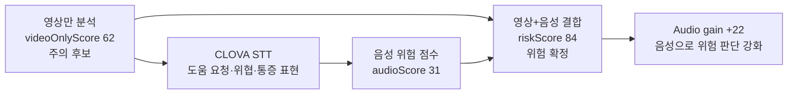
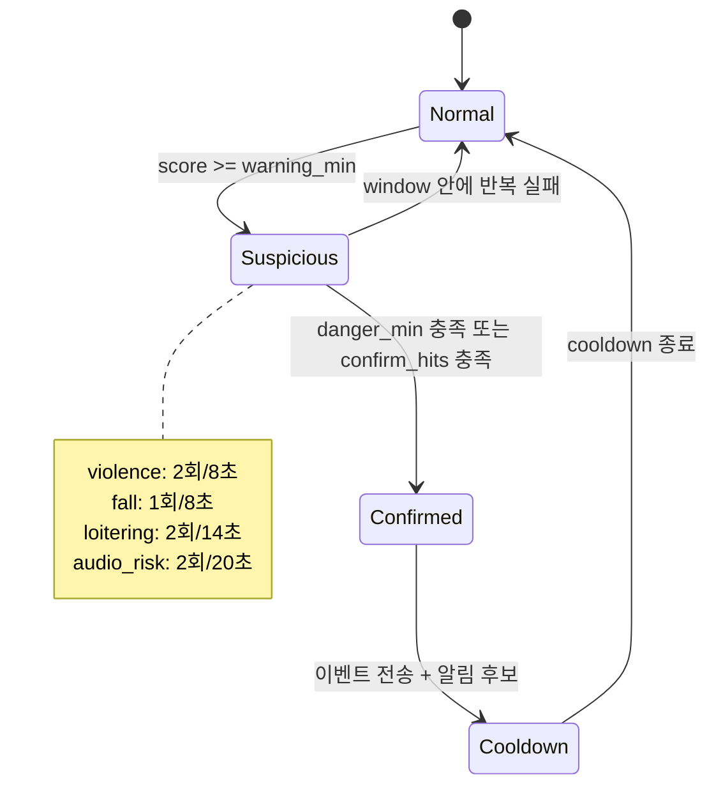
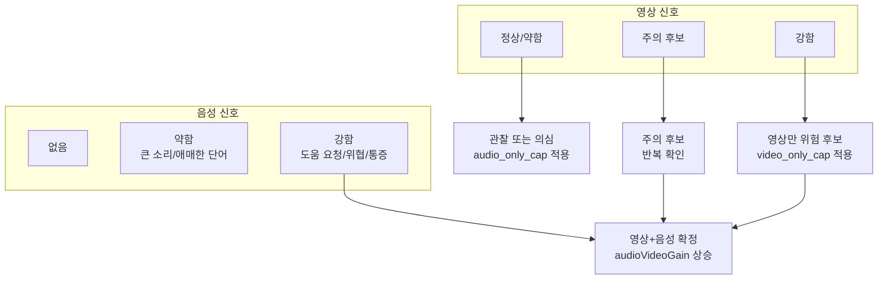
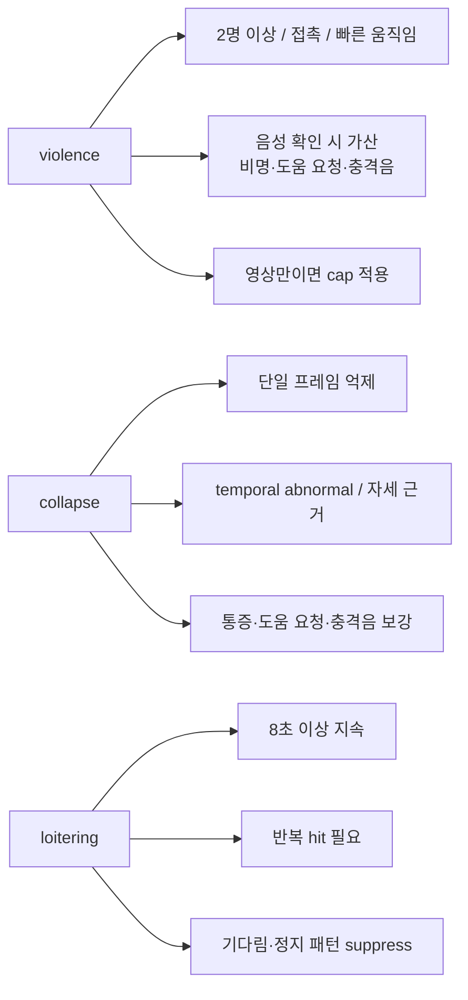
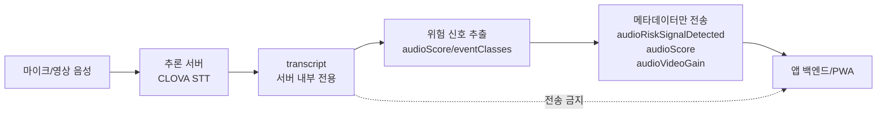
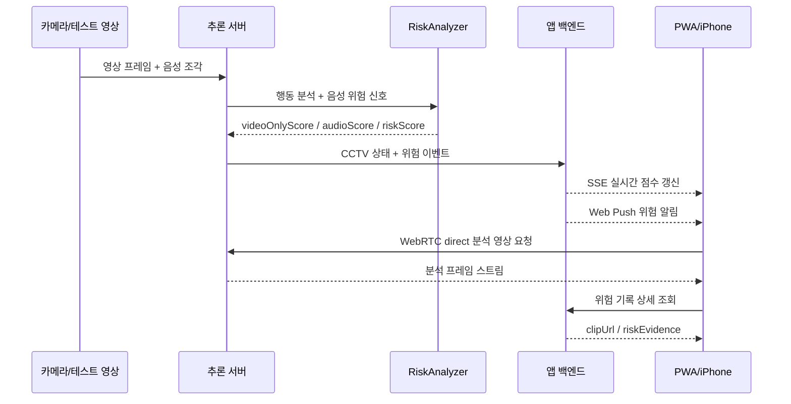

# detectWarning 발표용 추가 시각화 자료

이 문서는 발표 때 기존 시스템 아키텍처 도표와 함께 쓰기 좋은 보조 시각화 자료를 정리한 것이다.  
PNG 자료는 `python docs\render_presentation_visuals.py`로 생성한다.

## 1. 음성 사용 전/후 위험 점수 차이

발표 포인트: “영상만으로는 애매했던 상황이 음성 위험 신호와 결합되면서 더 높은 위험도로 확정된다.”

## 2. 위험 판단 상태 머신

발표 포인트: “한 번 튄 점수로 바로 위험을 띄우지 않고, 클래스별 threshold와 반복 확인을 거친다.”

## 3. 영상·음성 결합 판단 매트릭스

발표 포인트: “음성만으로 무조건 danger를 만들지 않고, 영상 근거와 결합될 때 강하게 올린다.”

## 4. 클래스별 오탐 억제 장치

발표 포인트: “폭력, 쓰러짐, 배회는 오탐 패턴이 다르기 때문에 같은 threshold를 쓰지 않는다.”

## 5. 개인정보 보호 경계

발표 포인트: “음성 인식을 쓰지만 STT 원문은 앱 백엔드로 보내지 않는다.”

## 6. 시연 흐름 스토리보드

발표 포인트: “카메라 입력부터 앱 알림과 위험 클립까지 실제 서비스 흐름으로 이어진다.”

